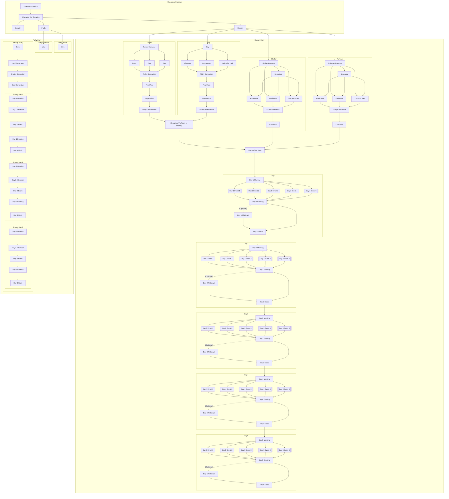

```mermaid

flowchart TD
    subgraph Character Creation
    A[Character Creation]
    CHAR1[Human]
    CHAR2[Fluffy]
    CHAR3[Smarty]
    B[Character Confirmation]
    end

    subgraph Human Story

    subgraph Fluffmart
    C[Fluffmart Entrance]
    C-1[Item Aisle]
    C-2[Adult Area]
    C-3[Foal Area]
    C-4[Discount Area]
    C-E[Checkout]
    C-G[Fluffy Generation]
    end

    subgraph Shelter    
    SH[Shelter Entrance]
    SH-1[Item Aisle]
    SH-2[Adult Area]
    SH-3[Foal Area]
    SH-4[Discount Area]
    SH-E[Checkout]
    SH-G[Fluffy Generation]
    end

    subgraph Forest
    FO[Forest Entrance]
    FO-1[Pond]
    FO-2[Field]
    FO-3[Tree]
    FO-G[Fluffy Generation]
    FO-G1[First Meet]
    FO-G2[Negotiation]
    FO-CNFRM[Fluffy Confirmation]
    end

    subgraph City
    CI[City]
    CI-1[Alleyway]
    CI-2[Restaurant]
    CI-3[Industrial Park]
    CI-G[Fluffy Generation]
    CI-G1[First Meet]
    CI-G2[Negotiation]
    CI-CNFRM[Fluffy Confirmation]
    end

    FOCI-SHOP["Shopping (Fluffmart or Shelter)"]
    G["Home (First Visit)"]
    
    subgraph Day 1
    D1-M[Day 1 Morning]
    D1-1[[Day 1 Event 1]]
    D1-2[[Day 1 Event 2]]
    D1-3[[Day 1 Event 3]]
    D1-4[[Day 1 Event 4]]
    D1-5[[Day 1 Event 5]]
    D1-E[Day 1 Evening]
    D1-F[Day 1 Fluffmart]
    D1-S[Day 1 Sleep]
    end

    subgraph Day 2
    D2-M[Day 2 Morning]
    D2-1[[Day 2 Event 1]]
    D2-2[[Day 2 Event 2]]
    D2-3[[Day 2 Event 3]]
    D2-4[[Day 2 Event 4]]
    D2-5[[Day 2 Event 5]]
    D2-E[Day 2 Evening]
    D2-F[Day 2 Fluffmart]
    D2-S[Day 2 Sleep]
    end

    subgraph Day 3
    D3-M[Day 3 Morning]
    D3-1[[Day 3 Event 1]]
    D3-2[[Day 3 Event 2]]
    D3-3[[Day 3 Event 3]]
    D3-4[[Day 3 Event 4]]
    D3-5[[Day 3 Event 5]]
    D3-E[Day 3 Evening]
    D3-F[Day 3 Fluffmart]
    D3-S[Day 3 Sleep]
    end

    subgraph Day 4
    D4-M[Day 4 Morning]
    D4-1[[Day 4 Event 1]]
    D4-2[[Day 4 Event 2]]
    D4-3[[Day 4 Event 3]]
    D4-4[[Day 4 Event 4]]
    D4-5[[Day 4 Event 5]]
    D4-E[Day 4 Evening]
    D4-F[Day 4 Fluffmart]
    D4-S[Day 4 Sleep]
    end

    subgraph Day 5
    D5-M[Day 5 Morning]
    D5-1[[Day 5 Event 1]]
    D5-2[[Day 5 Event 2]]
    D5-3[[Day 5 Event 3]]
    D5-4[[Day 5 Event 4]]
    D5-5[[Day 5 Event 5]]
    D5-E[Day 5 Evening]
    D5-F[Day 5 Fluffmart]
    D5-S[Day 5 Sleep]
    end
    end

    subgraph "Fluffy Story"
    subgraph "Fluffy (Male)"
    FLM-1[Intro]
    end

    subgraph "Fluffy (Female)"
    FMF-1[Intro]
    end

    subgraph Smarty Story
    SM-1[Intro]
    SM-2[Herd Generation]
    SM-3[Shelter Generation]
    SM-4[Goal Generation]

    subgraph Smarty Day 1
    SM-D1M[Day 1 Morning]
    SM-D1A[Day 1 Afternoon]
    SM-D1EV[Day 1 Event]
    SM-D1E[Day 1 Evening]
    SM-D1N[Day 1 Night]
    
    end
    subgraph Smarty Day 2
    SM-D2M[Day 2 Morning]
    SM-D2A[Day 2 Afternoon]
    SM-D2EV[Day 2 Event]
    SM-D2E[Day 2 Evening]
    SM-D2N[Day 2 Night]
    end
    
    subgraph Smarty Day 3
    SM-D3M[Day 3 Morning]
    SM-D3A[Day 3 Afternoon]
    SM-D3EV[Day 3 Event]
    SM-D3E[Day 3 Evening]
    SM-D3N[Day 3 Night]
    end
    end
    end

    A --> B
    B --> CHAR1 & CHAR2 & CHAR3

    CHAR1 --> C
    CHAR1 --> SH
    CHAR1 --> FO
    CHAR1 --> CI
    CHAR2 --> FLM-1
    CHAR2 --> FMF-1
    CHAR3 --> SM-1

    C --> C-1 & C-2 & C-3 & C-4
    C-1 ---> C-2 & C-3 & C-4
    C-2 & C-3 & C-4 -->C-G
    C-G-->C-E


    SH --> SH-1 & SH-2 & SH-3 & SH-4
    SH-1 ---> SH-2 & SH-3 & SH-4
    SH-2 & SH-3 & SH-4 -->SH-G
    SH-G-->SH-E
    

    CI-->CI-1 & CI-2 & CI-3
    CI-1 & CI-2 & CI-3 --> CI-G
    CI-G-->CI-G1
    CI-G1-->CI-G2
    CI-G2-->CI-CNFRM

    FO-->FO-1 & FO-2 & FO-3
    FO-1 & FO-2 & FO-3 --> FO-G
    FO-G-->FO-G1
    FO-G1-->FO-G2
    FO-G2-->FO-CNFRM

    FO-CNFRM & CI-CNFRM --> FOCI-SHOP
    FOCI-SHOP ---> G
    SH-E & C-E ---> G
    G--->D1-M

    D1-S-->D2-M
    D2-S-->D3-M
    D3-S-->D4-M
    D4-S-->D5-M

    D1-M --> D1-1 & D1-2 & D1-3 & D1-4 & D1-5
    D1-1 & D1-2 & D1-3 & D1-4 & D1-5 --> D1-E

    D1-E -. (Optional) .-> D1-F
    D1-F --> D1-S
    D1-E --> D1-S

    D2-M --> D2-1 & D2-2 & D2-3 & D2-4 & D2-5
    D2-1 & D2-2 & D2-3 & D2-4 & D2-5 --> D2-E

    D2-E -. (Optional) .-> D2-F
    D2-F --> D2-S
    D2-E --> D2-S

    D3-M --> D3-1 & D3-2 & D3-3 & D3-4 & D3-5
    D3-1 & D3-2 & D3-3 & D3-4 & D3-5 --> D3-E

    D3-E -. (Optional) .-> D3-F
    D3-F --> D3-S
    D3-E --> D3-S

    D4-M --> D4-1 & D4-2 & D4-3 & D4-4 & D4-5
    D4-1 & D4-2 & D4-3 & D4-4 & D4-5 --> D4-E

    D4-E -. (Optional) .-> D4-F
    D4-F --> D4-S
    D4-E --> D4-S

    D5-M --> D5-1 & D5-2 & D5-3 & D5-4 & D5-5
    D5-1 & D5-2 & D5-3 & D5-4 & D5-5 --> D5-E

    D5-E -. (Optional) .-> D5-F
    D5-F --> D5-S
    D5-E --> D5-S

    SM-1 --> SM-2
    SM-2 --> SM-3
    SM-3 --> SM-4
    SM-4 --> SM-D1M

    SM-D1M --> SM-D1A
    SM-D1A --> SM-D1EV
    SM-D1EV--> SM-D1E
    SM-D1E --> SM-D1N
    SM-D1N --> SM-D2M

    SM-D2M --> SM-D2A
    SM-D2A --> SM-D2EV
    SM-D2EV--> SM-D2E
    SM-D2E --> SM-D2N
    SM-D2N --> SM-D3M

    SM-D3M --> SM-D3A
    SM-D3A --> SM-D3EV
    SM-D3EV--> SM-D3E
    SM-D3E --> SM-D3N

    
```