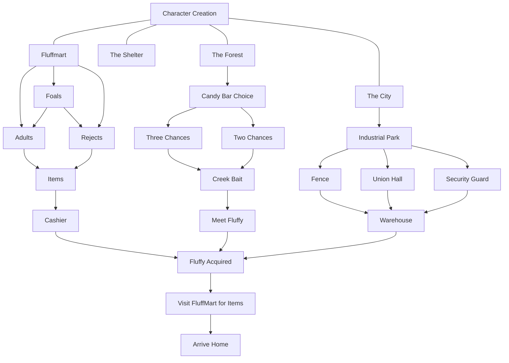

# Features

|Feature|Priority|Status|Notes|
|---|---|---|---|
|Event Pool|high|Not started|Need to be able to generate multiple passages, tag them as `event` or `event-race` and then have a widget to call random functions based on that.|
|Separated arrays|high|Started|Need to be able to remove options from an array based on conditionals, or change the array referenced by a widget based on conditionals. Usage is "if player is currently on \[passage\], roll a Fluffy/event using *this* instead of default."|
|Finalize day structure|high|Needs refining|Need to figure out how "time block" structure works. Current thoughts are either day-based, or week-based|
|Finalize win condition for Human path|high|Needs refining|Not sure what the point of a human's campaign is, or how the player "wins." Currently no goal besides seeing as many events as possible, and becomes difficult in order to have perpetual play without Fluffy age/dying/etc.|
|Add female art assets|Medium|Done!|Cosmetic, but will keep Fluffies from looking too samey.|

# Todo Resource Dump

## Separated Arrays

> → Returns [{ name : "Apricots" }]; $fruits [{ name : "Apples" }, { name : "Oranges" }] 
> $fruits.deleteWith(function (val) { 
> 	return val.name === "Apricots"; 
> }) 

# Bug Fixes

|Bug|Affects|Reproducible?|Status|
|---|---|---|---|
||||

# Story Structure Checklist

## Human Branch

Part 1: Getting Your Fluffy

This part is to explain how you get your Fluffy, and how you'll set it up for its life with you.

This chart is current up to 15/04/2025, and mostly so Recent knows what he still has to work on.

Part 2: Living With Your Fluffy